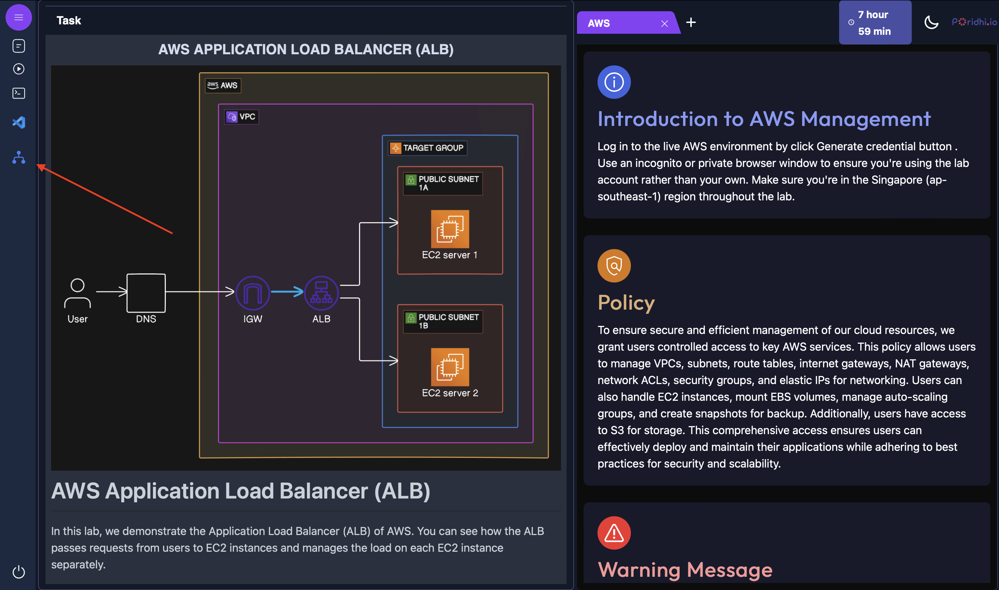
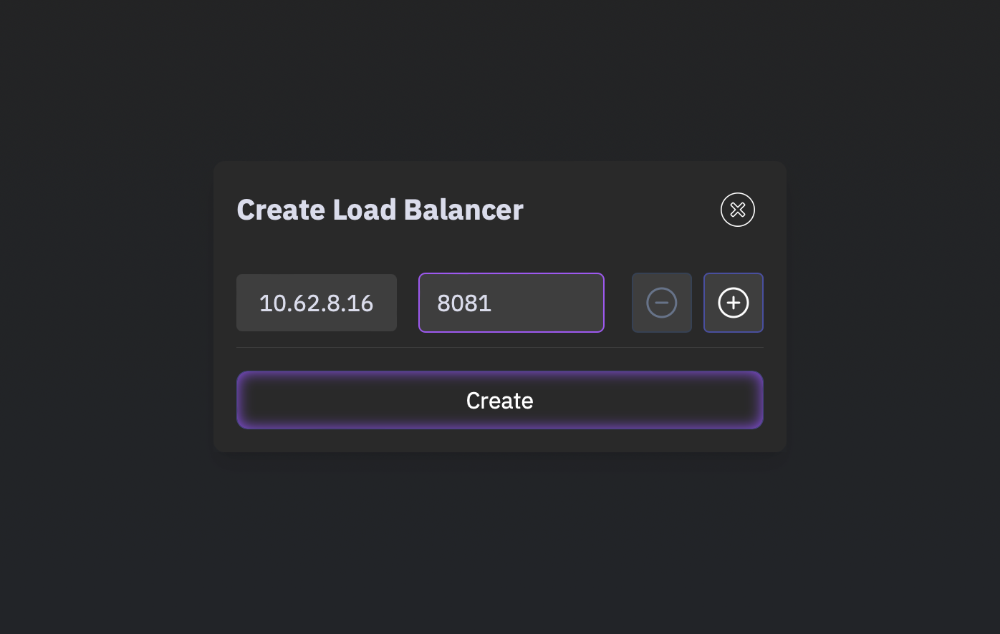

# Integration of S3 with Apache Airflow

Tags: Airflow, Docker, MLOps, S3
Class: AF3
Created: November 21, 2024 1:02 PM

In this experiment, we’ll try to integrate the S3 bucket with Apache Airflow and schedule the process of it. In the end, we launch it using Load Balancer of Poridhi Lab and monitor the GUI of the dag dashboard.

# Objectives:

- To Integrate Apache Airflow with AWS S3.

## Table of contents:

- What is S3?
- Setup your environment.
- AWS account creation.
- Setting up the connection in Apache Airflow.
- VSCode environment setup.
- Issues.

## What is S3?

Amazon Simple Storage Service (S3) is **a massively scalable storage service based on object storage technology**. It provides a very high level of durability, with high availability and high performance. Data can be accessed from anywhere via the Internet, through the Amazon Console and the powerful S3 API.


To integrate S3 with Apache Airflow, you'll need to set up Airflow to interact with S3 buckets. Here's a step-by-step tutorial to help you achieve this:

## Step 01: Setup your environment.

These following steps will help you to configure your environment. If they are already set in your local machine, you can skip.

- Install Homebrew, Open Terminal and run

```python
/bin/bash -c "$(curl -fsSL [https://raw.githubusercontent.com/Homebrew/install/HEAD/install.sh](https://raw.githubusercontent.com/Homebrew/install/HEAD/install.sh))"
```

- Install Visual Studio Code

```python
brew install --cask visual-studio-code
```

- Install Docker

```python
brew install --cask docker
```

- Install Python

```python
brew install python
```

- Install AWS CLI

```python
brew install awscli
```

## Step 02: AWS account creation

- To install AWS CLI (if not installed).
    
    ```markup
    curl "[https://awscli.amazonaws.com/awscli-exe-linux-x86_64.zip](https://awscli.amazonaws.com/awscli-exe-linux-x86_64.zip)" -o "awscliv2.zip"
    unzip awscliv2.zip
    sudo ./aws/install
    ```
    
    ```markup
    aws --version
    ```
    
- Set up your AWS configure.
    
    ```markup
    aws configure
    ```
    
- For ACCESS_KEY & SECRET_ACCESS_KEY, you can generate them from **Poridhi Lab** for the purpose given later.


## Step 03: Setting up the connection in Apache Airflow GUI:

- Go to Apache Airflow GUI using [localhost:8080](http://localhost:8080) and login using the username and password created before.

- Go to Admin >  Connections > Add a new record [+].

- Fill this as following. For the Access key and Secret Access Key, put the generated credentials.


## Step 04: VSCode environment setup

- Update the commands.

```markup
sudo apt update
```

```markup
sudo apt upgrade -y
```

- Create a new directory for you Airflow project:

```python
mkdir airflow-s3-project
cd airflow-s3-project
```

- Create a virtual environment and activate it

```python
python3 -m venv s3
source s3/bin/activate
```

**Creating a DAG:**

- Install Apache Airflow (if not installed) :

```python
pip install apache-airflow
```

or,

```markup
AIRFLOW_VERSION=2.7.3
PYTHON_VERSION="$(python3 --version | cut -d " " -f 2 | cut -d "." -f 1-2)"
CONSTRAINT_URL="[https://raw.githubusercontent.com/apache/airflow/constraints-${AIRFLOW_VERSION}/constraints-${PYTHON_VERSION}.txt](https://raw.githubusercontent.com/apache/airflow/constraints-$%7BAIRFLOW_VERSION%7D/constraints-$%7BPYTHON_VERSION%7D.txt)"
pip install "apache-airflow==${AIRFLOW_VERSION}" --constraint "${CONSTRAINT_URL}"
```

- Install Apache Airflow with Amazon provider:

```python
pip install apache-airflow apache-airflow-providers-amazon
```

- Create a docker-compose.yaml file:

```python
curl -LfO '[https://airflow.apache.org/docs/apache-airflow/2.7.1/docker-compose.yaml](https://airflow.apache.org/docs/apache-airflow/2.7.1/docker-compose.yaml)'
```

- Create a .env file in the same directory:

```python
echo -e "AIRFLOW_UID=$(id -u)\nAIRFLOW_GID=0" > .env
```

- Modify the docker-compose.yaml file:
    
    
    

Make these changes :

```python
AWS_ACCESS_KEY_ID: ${AWS_ACCESS_KEY_ID}
AWS_SECRET_ACCESS_KEY: ${AWS_SECRET_ACCESS_KEY}
AWS_DEFAULT_REGION: ${AWS_DEFAULT_REGION}
```

Use the credentials generated from **Poridhi Lab** (previously given).

- Create a dags folder in project directory:

```python
mkdir ./dags
```

- Create a new python file in the dags folder, here as example: s3_integration_dag.py and run this code:

```python
from airflow import DAG
from airflow.providers.amazon.aws.operators.s3 import S3CreateBucketOperator, S3DeleteBucketOperator
from airflow.providers.amazon.aws.transfers.local_to_s3 import LocalFilesystemToS3Operator
from datetime import datetime, timedelta

default_args = {
    'owner': 'airflow',
    'depends_on_past': False,
    'start_date': datetime(2024, 10, 6),
    'email_on_failure': False,
    'email_on_retry': False,
    'retries': 1,
    'retry_delay': timedelta(minutes=5),
}

dag = DAG(
    's3_integration_example',
    default_args=default_args,
    description='A simple DAG to demonstrate S3 integration',
    schedule=timedelta(days=1),
)

create_bucket = S3CreateBucketOperator(
    task_id='create_bucket',
    bucket_name='my-airflow-bucket-{}'.format(datetime.now().strftime('%Y%m%d%H%M%S')),
    region_name='us-east-1',
    aws_conn_id='aws_default',
    dag=dag,
)

upload_file = LocalFilesystemToS3Operator(
    task_id='upload_file',
    filename='/path/to/local/file.txt',
    dest_key='file.txt',
    dest_bucket='{{ task_instance.xcom_pull(task_ids="create_bucket") }}',
    aws_conn_id='aws_default',
    dag=dag,
)

delete_bucket = S3DeleteBucketOperator(
    task_id='delete_bucket',
    bucket_name='{{ task_instance.xcom_pull(task_ids="create_bucket") }}',
    force_delete=True,
    aws_conn_id='aws_default',
    dag=dag,
)

create_bucket >> upload_file >> delete_bucket
```

This DAG will 

1. Create a new S3 bucket.
2. Upload a local file to the bucket.
3. Delete the bucket (for demonstration purpose).

- Start the Airflow services:

```markup
docker-compose up —-build
```


```python
docker-compose up -d
```

## Step 05: Launch the Airflow GUI using the Load Balancer.






- Access the Airflow web and login with the username and password.
    
    
    

- You might see this view first, all are example DAGs.
    
    
    

- To remove these example DAG files, go to the yaml file and change this from true → false.
    
    
    

- After refreshing the DAG dashboard will look like this.
    
    
    

- Enable and trigger your DAG execution from the Airflow UI and monitor it.
- The possible output :


- The grid view:
    
    
    

- To stop the Docker container, use this command:

```python
docker-compose down
```

### **Issue 01: If you are unable to login to Airflow GUI**

- Verify your user creation using this command.

```python
docker exec -it s3airflow-airflow-webserver-1 airflow users list
```

likely to be get an output like this:


If not, then your account creation wasn’t right. Create using the code previously given.

- To synchronize the database run this command

```python
docker-compose restart airflow-webserver
```

or, 

```python
docker-compose down -v
docker-compose up -d
```

### Issue 02: **After your DAG showed up in dashboard but you can’t trigger this and get this message.**


- Check if the DAG file is in the dags folder.
- The file name must match the dag_id on your dag file.
    
    
    
- Then try running this command on your terminal

```python
docker-compose restart
```

If this still doesn’t solve your problem

- Make sure that the file and folder permissions allow the Airflow process to access and read the DAG file.

```python
ls -l dags/s3_integration_example.py
```

might give this as output:

```python
-rw-r--r--  1 username  groupname  1234 Jan 1 00:00 s3_integration_example.py
```

> Tips: Do not change the yaml file other than the given instruction, it might give some issues regarding finding dag in the dashboard or no getting connected to Docker.
> 

# Conclusion:

You have successfully created and scheduled the S3 with Apache Airflow.
